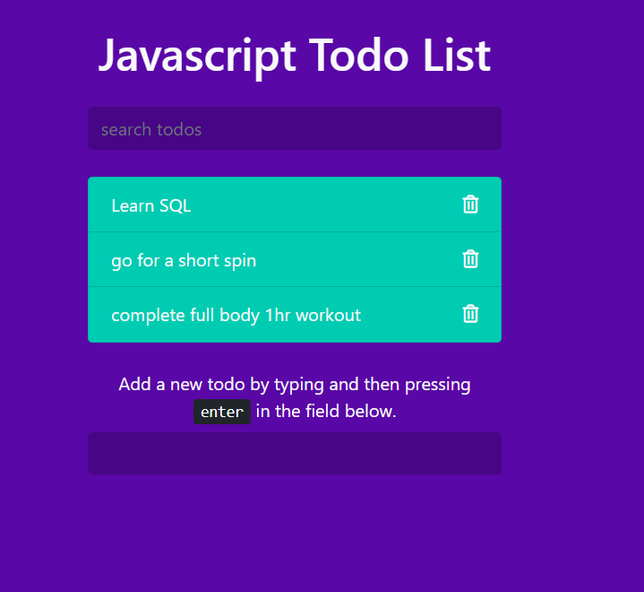

# ToDoList

This is a javascript todo list application. 
You can add/remove todos and search for existing todos in the list.
The UI is built using HTML, CSS and Bootstrap, the backend is all done using Javascript.

the to-do list created has a beautiful UI, the user can add a to-do by filling the input and hit ENTER, after that user can rather check the to-do when it's done, or remove it using the delete button.

The user's to-do list is stored in the local storage, so when user refreshes the page, user can always find the list there.

